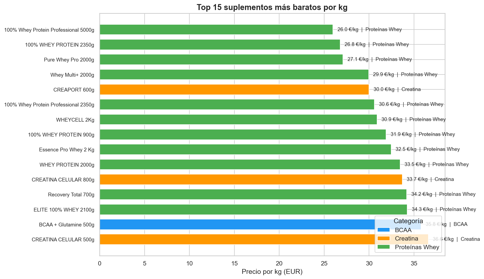
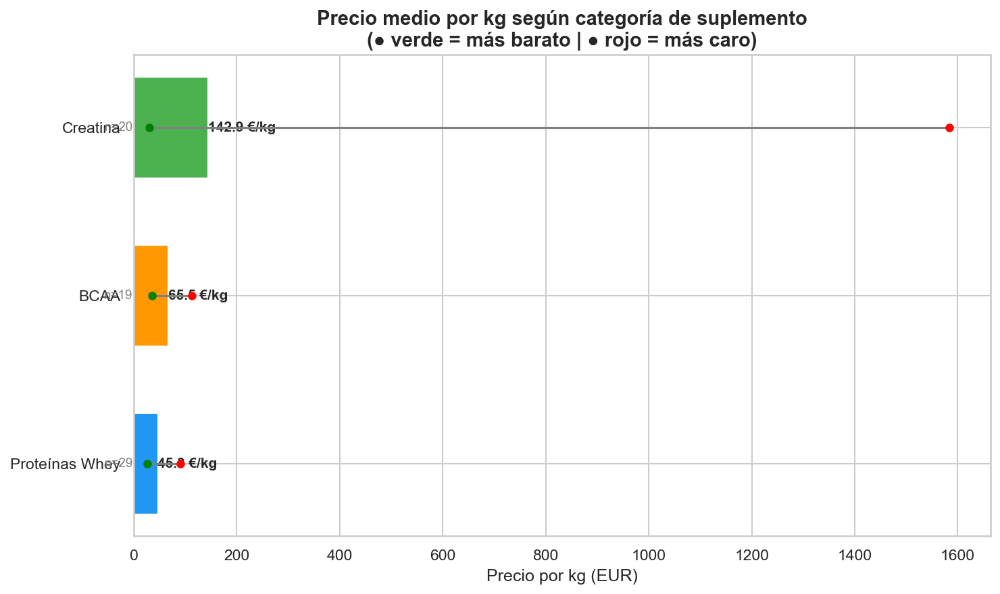
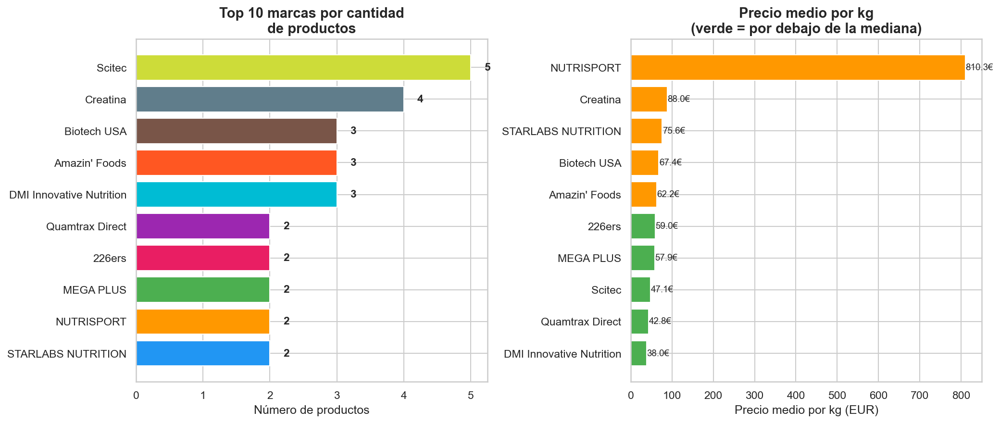
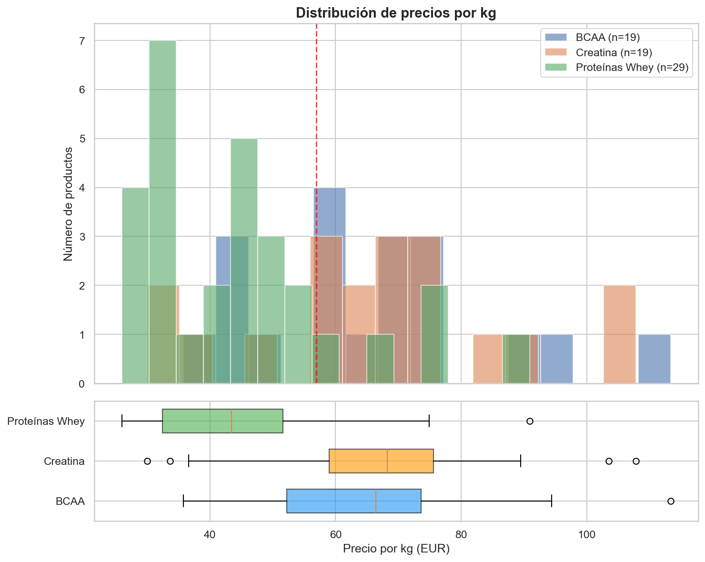
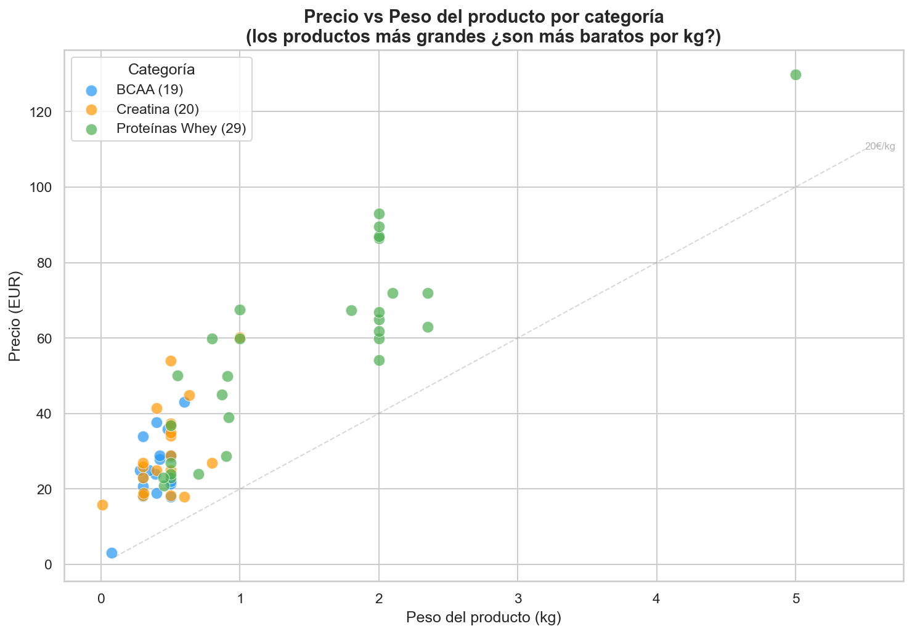

# 🏋️ Supplement Price Tracker — Spain

**Automated pipeline to scrape, clean, and analyze supplement prices from Spanish online stores.**

Built as a data engineering / data science portfolio project. Collects real pricing data from fitness supplement retailers, processes it into a clean dataset, and generates visual analysis.



---

## What It Does

1. **Scrapes** product data (name, brand, price, weight) from Spanish supplement stores
2. **Cleans** raw data: normalizes prices, extracts weights, calculates price per kg
3. **Analyzes** the dataset with statistics and visualizations
4. **Outputs** clean CSV/JSON datasets and publication-ready charts

---

## Sample Findings

- Whey protein averages **45 €/kg**, making it the most cost-effective protein supplement
- Buying larger formats (2–5 kg) reduces the price per kg by up to **40%**
- Creatine in capsule form can cost **5x more per kg** than powder format
- Best value found: 100% Whey Protein Professional 5000g at **26 €/kg**

---

## Tech Stack

| Tool | Purpose |
|------|---------|
| Python 3 | Core language |
| requests | HTTP requests to download web pages |
| BeautifulSoup | HTML parsing and data extraction |
| pandas | Data cleaning, transformation and analysis |
| matplotlib + seaborn | Data visualization |

---

## Project Structure

```
supplement-scraper/
├── scraper.py          # Web scraping logic (Nutritienda.com)
├── limpieza.py         # Data cleaning functions (price parsing, weight extraction)
├── analisis.py         # Exploratory data analysis + chart generation
├── requirements.txt    # Python dependencies
├── datasets/           # Generated CSV and JSON datasets
│   └── suplementos_YYYYMMDD.csv
└── graficas/           # Generated charts
    ├── 01_precio_por_categoria.png
    ├── 02_top_marcas.png
    ├── 03_precio_por_kg_distribucion.png
    ├── 04_precio_vs_peso.png
    └── 05_mejores_ofertas.png
```

---

## How to Run

```bash
# Clone the repo
git clone https://github.com/YOUR_USERNAME/supplement-price-tracker.git
cd supplement-price-tracker

# Install dependencies
pip install -r requirements.txt

# Run the scraper (generates CSV + JSON in datasets/)
python scraper.py

# Run the analysis (generates charts in graficas/)
python analisis.py
```

---

## Visualizations

### Price per kg by category
Shows average, minimum and maximum price per kg for each supplement type.



### Top brands — quantity vs price
Left: brands with most products. Right: average price per kg (green = below median).



### Price distribution
Histogram + boxplot showing how prices per kg are distributed across categories.



### Price vs Weight
Scatter plot exploring whether larger products offer better value per kg.



---

## Data Pipeline

```
[Nutritienda.com]  →  requests.get()  →  BeautifulSoup  →  Raw products list
                                                                    │
                                                                    ▼
                                                          limpieza.py
                                                          - Parse prices (€ → float)
                                                          - Extract weight (kg)
                                                          - Calculate price/kg
                                                          - Remove duplicates
                                                                    │
                                                                    ▼
                                                          CSV + JSON dataset
                                                                    │
                                                                    ▼
                                                          analisis.py
                                                          - Statistics
                                                          - 5 chart types
                                                          - Best deals ranking
```

---

## Key Technical Decisions

- **BeautifulSoup over Selenium**: The target site renders products server-side, so a lightweight HTTP client is enough — no need for a headless browser.
- **CSS selectors found via Chrome DevTools**: Used `Ctrl+U` (view source) and `F12 > Network` to inspect the HTML structure and identify `span.price`, `h3 a`, and `div.grid-info-wrapper` as the relevant selectors.
- **Price per kg as the core metric**: Raw prices are not comparable across different package sizes. Normalizing to €/kg enables fair comparison.
- **Delay between requests**: 3-second pause between category pages to respect the server and avoid rate limiting.

---

## Roadmap

- [x] Scraper for Nutritienda.com (3 categories, 88+ products)
- [x] Data cleaning pipeline with pandas
- [x] Exploratory analysis with 5 chart types
- [ ] Add more stores (HSN, MyProtein, Amazon ES)
- [ ] Automate with cron or n8n for daily/weekly updates
- [ ] Historical price tracking over time
- [ ] Web-based price comparison tool with affiliate links

---

## License

MIT

---

## About

Portfolio project by Javier Ortigosa — Mathematics Engineering student interested in data engineering, data science, and automation.

Built with Python. Developed with AI assistance as a learning tool.
